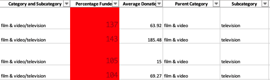

# Kickstarting with Excel

## Overview of Project

Kickstarter is a very successful crowdfunding service. Since its creation in April 2009 the platform has had over 515480 Launched campaigns with a success rate of about 38,5%.

getting funded on Kickstarter means meeting or exceeding the project's initial goal, in this analysis we are looking through past projects in an attempt to uncover trends and generate insights into how different factors influence campaign outcomes.

The data we will be working with is in excel Spreadsheet form, that consists of 4113 rows, each representing a project, columns have qualitative and quantitive data including the name of the project, the type, the date of launch and end of the campaign, and whether it was successful or not, etc..

We will be focusing on plays and projects that belong to the theater category since that's what the client is interested in.

## Analysis and Challenges

### Challenges:

The data set is made up of exactly 4113 example while Kickstarter official website shows over 515000 Campaigns since its launch. Since we don't know that the subset (our dataset) has been selected randomly, and because of how limited it is (constitutes less than 1% of campaigns on Kickstarter) we should consider the analysis to be inconclusive.
 That being said the analysis can still be very insightful and help us form a good preliminary understanding of kickstarter project outcomes and how different factors influence them.

### Analysis:

 - Preparing the data: 

- to make It visually easy to spot the outcome of the kickstarter , we used conditional formatting to color each cell in the outcome column with a different color, depending on whether the associated campaign was successful, failed, or canceled, or is currently live.

- We can use the amount of money pledged and raised by each campaign to calculate the average donation per campaign using the number of backers, and also the percentage funded which represents how much money a campaign made towards reaching its goal.
- In order for our analysis to be specific, it would be wise to split the category and subcategory column into 2 respective columns, named Parent category and Subcategory.

- The dates we have in this dataset are in Unix timestamp form, to be able to understand them, we will have to convert them into excel date format, 2 new columns have been created to hold the values, Date Created Conversion and Date Ended Conversion.

### Analyzing :

* First we need to understand how different campaign categories perform compare to each other. For that we create a pivot table that represents the number of campaigns that are either "successful", "failed", "cancelled", or are currently "live" per category.

Next we create a pivot chart based on the previous table.

Looking that chart We can easily notice that:

- Music category has a highest success rate.
- Journalism campaigns have a 100% cancelation rate.
- Theater is the largest category for Kickstarter campaigns and also the one with the highest number of successful campaigns.

 After looking at the parent categories, we're going to examine how different subcategories compare to each other in performance. For that we create a pivot table that represents the number of campaigns that are either "successful", "failed", "cancelled", or are currently "live" per Subcategory. 
 
 

Next we create a pivot chart based on the previous table.

Looking at the chart We can easily notice that:
- The Plays Subcategory outnumbers the rest of the Subcategories by a big margin, it also has a good success rate.
- A few subcategories have a 100 % success rate such as documentary; classical music; hardware; Shorts; rock; electronic music and metal. That been said a few of them only have a small number of campaigns and by consequence might not be conclusive.
- A few subcategories Such as Animation; food trucks, and video games ... have a 100% failure rate

Since we are mostly intersted in the theatre category and the plays subcategory, this is the previous charts showing only the category and subcategory of intrest. 

  

### Analysis of Outcomes Based on Launch Date 

In order for us to analyze the relationship between the Launch Date and the campaigns outcome we needed to create a table that shows the different outcomes over time. 

Since it's a Chart that will represent the change of outcomes over time, a line chart is best fit to visually represent the correlation.

Based on the previous figure we can see: 
- There's a spike in the number of successful campaigns around May and June.
- The success rates drop significantly around October.

### Analysis of Outcomes Based on Goals

The Next step would be to see how plays with different Goals do in comparison, For that we have to create a few columns with information that doesn't exist in the dataset but can be easily calculated using Excel's countIFS() , we will also need to group the Goals into Ranges to show which range of goals have the highest chance of success. 
The Columns we created are:

* `Number Successful`
* `Number Failed`
* `Number Cancelled`
* `Total Projects`
* `Percentage Successful`
* `Percentage Failed`
* `Percentage Cancelled`

We can represent the data visually using a Graph:

Based on the previous figure we can read that:
- The Optimal range for a successful campaign for a play seems to be between 35K and 50K.
- Overall The higher the goal the lower the probability of success except for what seems to be the optimal margin. 
- No canceled plays fundraisers.

## What are some limitations of this dataset?

- The biggest subcategory in this dataset was plays, that is not reflective in reality for kickstarter fundraisers.
- The Dataset lacks up to date data, the data we have is up to 2017.
- We only have 4113 entries and that's less than 1% of Kickstarter campaigns.

### What are some other possible tables and/or graphs that we could create?

- we could create a graph that plots the probability of success by subcategory (successful ÷ (failed + canceled)), we could filter it using launch dates or countries.

